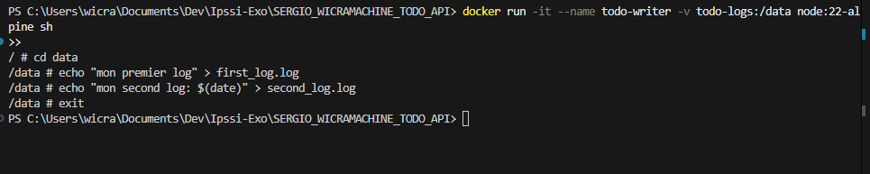

# Todo API - DevOps & Dockerization Project

Ce projet est une API REST de gestion de tâches (Todo API) développée avec Node.js (Express), entièrement dockerisée, préparée pour la CI/CD et intégrant des tests automatisés (Jest & Supertest).

## 📌 Sommaire

1. [🚀 Fonctionnalités & Architecture](#-fonctionnalités--architecture)
   - [📁 Structure du Projet](#-structure-du-projet)
2. [🛠️ Lancement Local (Développement)](#️-lancement-local-développement)
3. [🐳 Lancement avec Docker (Recommandé)](#-lancement-avec-docker-recommandé)
4. [partie1_docker_architecture_fondations](#partie1_docker_architecture_fondations)
   - [Exercice 1 : Volumes Basiques et Partage de Données](#exercice-1--volumes-basiques-et-partage-de-données)
   - [Exercice 2 : Todo App et Persistance via Docker Compose](#exercice-2--todo-app-et-persistance-via-docker-compose)
5. [📖 API Documentation](#-api-documentation)
6. [partie2_approfondissement_docker](#partie2_approfondissement_docker)
   - [1. EXERCICE GUIDÉ 1 : Créer et utiliser un network custom](#1-exercice-guidé-1--créer-et-utiliser-un-network-custom)
   - [2. EXERCICE GUIDÉ 2 : Network dans docker-compose](#2-exercice-guidé-2--network-dans-docker-compose)
   - [3. EXERCICE GUIDÉ 1 (Variables) : Passer des variables d'environnement](#3-exercice-guidé-1-variables--passer-des-variables-denvironnement)
   - [4. EXERCICE GUIDÉ 2 (Variables) : Utiliser un fichier .env](#4-exercice-guidé-2-variables--utiliser-un-fichier-env)
   - [5. EXERCICE GUIDÉ (Expose vs Ports) : Comprendre l'exposition](#5-exercice-guidé-expose-vs-ports--comprendre-lexposition)
   - [6. Exercice Pratique 3 : Débugger des Dockerfiles Cassés](#6-exercice-pratique-3--débugger-des-dockerfiles-cassés)
   - [7. Exercice Pratique 4 : Débugger un docker-compose.yml](#7-exercice-pratique-4--débugger-un-docker-composeyml)
   - [8. Exercice Pratique 5 : Challenge d'Optimisation (Todo API)](#8-exercice-pratique-5--challenge-doptimisation-todo-api)

---

## 🚀 Fonctionnalités & Architecture

L'application expose les routes CRUD classiques pour gérer des tâches avec le schéma de données suivant :
- **id** : Identifiant unique (UUID)
- **title** : Titre de la tâche (optionnel)
- **description** : Description détaillée (obligatoire)
- **status** : Statut actuel (ex: `pending`, `in-progress`, `completed`)
- **createdAt** / **updatedAt** : Horodatages automatiques

### 📁 Structure du Projet

```text
SERGIO_WICRAMACHINE_TODO_API/
├── exercices/
│   ├── 02_network_compose/   # Exercice guidé 2 : Network dans docker-compose
│   │   └── docker-compose.yml
│   ├── 03_env_run/           # Exercice guidé 1 : Variables d'environnement
│   │   ├── Dockerfile
│   │   ├── docker-compose.yml
│   │   └── server.js
│   ├── 04_env_file/          # Exercice guidé 2 : Utilisation de fichier .env
│   │   ├── .env.example
│   │   ├── Dockerfile
│   │   ├── docker-compose.yml
│   │   └── server.js
│   ├── 05_expose_ports/      # Exercice guidé : Expose vs Ports
│   │   ├── Dockerfile
│   │   ├── app.js
│   │   └── docker-compose.yml
│   ├── 06_debug_dockerfile/  # Exercice pratique 3 : Débugger des Dockerfiles
│   │   ├── debug-1/          # Dockerfile #1 (syntaxe CMD)
│   │   │   ├── Dockerfile
│   │   │   ├── package.json
│   │   │   └── server.js
│   │   ├── debug-2/          # Dockerfile #2 (ordre de COPY pour le cache)
│   │   │   ├── Dockerfile
│   │   │   ├── package.json
│   │   │   └── server.js
│   │   └── debug-3/          # Dockerfile #3 (Alpine + multi-stage)
│   │       ├── Dockerfile
│   │       └── package.json
│   └── 07_debug_compose/     # Exercice pratique 4 : Débugger un docker-compose.yml
│       ├── Dockerfile
│       ├── app.js
│       └── docker-compose-broken.yml
├── src/
│   ├── middleware/
│   │   └── errorHandler.js   # Middleware global de capture d'erreurs
│   ├── models/
│   │   └── task.js           # Modèle de données & stockage JSON
│   ├── routes/
│   │   └── tasks.js          # Endpoints CRUD de l'API
│   ├── app.js                # Initialisation d'Express (Helmet, CORS, etc.)
│   └── index.js              # Point d'entrée de démarrage du serveur
├── tests/
│   ├── unit/
│   │   └── task.test.js      # Tests unitaires du modèle Task
│   └── integration/
│       └── api.test.js       # Tests d'intégration des routes HTTP
├── docker-compose.yml        # Orchestration locale avec persistance de la Todo API
├── .dockerignore             # Fichiers ignorés lors du build Docker
├── .gitignore                # Fichiers exclus de Git
├── package.json              # Dépendances & scripts du projet
└── README.md                 # Ce fichier de documentation
```

---

## 🛠️ Lancement Local (Développement)

### Prérequis
- [Node.js](https://nodejs.org/) (version 20 recommandée)
- [npm](https://www.npmjs.com/)

### Étape 1 : Installer les dépendances
```bash
npm install
```

### Étape 2 : Démarrer le serveur
* En mode classique :
  ```bash
  npm start
  ```
* En mode développement (avec auto-reload) :
  ```bash
  npm run dev
  ```
Le serveur sera disponible sur [http://localhost:3000](http://localhost:3000).

### Étape 3 : Exécuter les tests
```bash
npm test
```

---

## 🐳 Lancement avec Docker (Recommandé)

Le projet utilise un **Volume Docker** pour stocker localement le fichier de données JSON (`data/tasks.json`). Cela garantit que vos tâches sont conservées même après l'arrêt ou la suppression des conteneurs.

### Prérequis
- [Docker](https://www.docker.com/) et Docker Compose

### Étape 1 : Lancer l'environnement
```bash
docker compose up --build
```
L'API démarre et est accessible sur le port **3000** : `http://localhost:3000`.

### Étape 2 : Vérifier la persistance (Volume)
1. Créez une tâche via l'API (voir section Documentation API ci-dessous).
2. Arrêtez le conteneur :
   ```bash
   docker compose down
   ```
3. Relancez-le :
   ```bash
   docker compose up
   ```
4. Listez les tâches : vos données sont toujours présentes grâce au montage de volume configuré dans le `docker-compose.yml` (`./data:/usr/src/app/data`).

---

## partie1_docker_architecture_fondations

Ce projet valide les exigences de l'exercice de mise en pratique des bases DevOps (API Node.js et Dockerisation). Les tests de validation suivants ont été effectués pour prouver le bon fonctionnement de l'infrastructure et de la persistance des données.

### Exercice 1 : Volumes Basiques et Partage de Données

Cet exercice valide la création et l'utilisation d'un volume partagé entre conteneurs.

1. **Création et écriture dans le volume**
   - Création du volume Docker dédié aux logs (`todo-logs`).
   - Lancement d'un conteneur interactif (`todo-writer`) avec montage du volume sur `/data`.
   - Écriture de données de test dans les fichiers `first_log.log` et `second_log.log`.
   
   
   

2. **Lecture depuis un nouveau conteneur**
   - Lancement d'un second conteneur indépendant (`todo-reader`), montant le même volume `todo-logs`.
   - Affichage du contenu des fichiers, confirmant que les données écrites par le premier conteneur sont bien partagées et persistées.
   
   
   

### Exercice 2 : Todo App et Persistance via Docker Compose

Cet exercice valide la persistance des données de l'API Node.js à travers les redémarrages de l'infrastructure globale.

1. **Démarrage de l'infrastructure**
   - Lancement des services définis dans le `docker-compose.yml` en arrière-plan (`api`, `db`, `redis`).

2. **Création d'une donnée via l'API**
   - Envoi d'une requête HTTP POST vers l'endpoint `/api/tasks` pour enregistrer une nouvelle tâche.
   - Validation de la réponse HTTP 201 Created contenant l'identifiant unique de la tâche.
   
   
   

3. **Validation de la persistance**
   - Arrêt complet et suppression des conteneurs via la commande d'extinction de Docker Compose.
   - Redémarrage à zéro de l'infrastructure.
   - Envoi d'une requête HTTP GET vers l'endpoint `/api/tasks`.
   - Vérification de la présence de la tâche précédemment créée, confirmant l'efficacité du volume lié aux données applicatives.
   
   

---

## 📖 API Documentation

### 🔍 Health Check
* **GET** `/health`
  * Retourne l'état de l'API.
  * **Réponse (200 OK) :**
    ```json
    { "status": "ok", "timestamp": "2026-06-03T11:45:00.000Z" }
    ```

### 📋 Gestion des tâches (Tasks)

* **GET** `/api/tasks`
  * Récupère la liste de toutes les tâches.
  * **Réponse (200 OK) :** `[]` ou liste de tâches.

* **POST** `/api/tasks`
  * Crée une nouvelle tâche.
  * **Corps de la requête :**
    ```json
    {
      "title": "Ma première tâche",
      "description": "Installer et configurer Docker sur ma machine",
      "status": "pending"
    }
    ```
  * **Réponse (201 Created) :** Tâche créée avec son `id`, `createdAt` et `updatedAt`.

* **GET** `/api/tasks/:id`
  * Récupère les détails d'une tâche spécifique par son identifiant unique.
  * **Réponse (200 OK / 404 Not Found)**

* **PUT** `/api/tasks/:id`
  * Modifie une tâche existante.
  * **Corps de la requête (champs optionnels) :**
    ```json
    {
      "status": "completed"
    }
    ```
  * **Réponse (200 OK / 404 Not Found)**

* **DELETE** `/api/tasks/:id`
  * Supprime une tâche.
  * **Réponse (204 No Content / 404 Not Found)**

---

## partie2_approfondissement_docker

### 1. EXERCICE GUIDÉ 1 : Créer et utiliser un network custom

#### Étape 1 : Créer le network
```bash
$ docker network create app-network
e3a0089eb0a608543984eea9741b2354570fc21cd2cff6e3b73bfa630135b01b
```

#### Étape 2 : Lancer un conteneur "serveur"
```bash
$ docker run -dit --name serveur --network app-network alpine sh
9c1d933ae88dfb5295d4262de38d458d06f4dfcf13907aff7605b081ca86e6ef

$ docker exec serveur apk add --no-cache curl
(1/9) Installing brotli-libs (1.2.0-r0)
(2/9) Installing c-ares (1.34.6-r0)
(3/9) Installing libunistring (1.4.1-r0)
(4/9) Installing libidn2 (2.3.8-r0)
(5/9) Installing nghttp2-libs (1.69.0-r0)
(6/9) Installing libpsl (0.21.5-r3)
(7/9) Installing zstd-libs (1.5.7-r2)
(8/9) Installing libcurl (8.19.0-r0)
(9/9) Installing curl (8.19.0-r0)
Executing busybox-1.37.0-r30.trigger
OK: 13.0 MiB in 25 packages
```

#### Étape 3 : Lancer un conteneur "client"
```bash
$ docker run -dit --name client --network app-network alpine sh
5306cd9c4488b0d0ffb58929d90fff8c9dedae8f1431c8b2e14263e80e4793aa

$ docker exec client apk add --no-cache curl
(1/9) Installing brotli-libs (1.2.0-r0)
(2/9) Installing c-ares (1.34.6-r0)
(3/9) Installing libunistring (1.4.1-r0)
(4/9) Installing libidn2 (2.3.8-r0)
(5/9) Installing nghttp2-libs (1.69.0-r0)
(6/9) Installing libpsl (0.21.5-r3)
(7/9) Installing zstd-libs (1.5.7-r2)
(8/9) Installing libcurl (8.19.0-r0)
(9/9) Installing curl (8.19.0-r0)
Executing busybox-1.37.0-r30.trigger
OK: 13.0 MiB in 25 packages
```

#### Étape 4 : Tester la communication
```bash
$ docker exec client ping -c 3 serveur
PING serveur (172.23.0.2): 56 data bytes
64 bytes from 172.23.0.2: seq=0 ttl=64 time=1.104 ms
64 bytes from 172.23.0.2: seq=1 ttl=64 time=0.096 ms
64 bytes from 172.23.0.2: seq=2 ttl=64 time=0.095 ms

--- serveur ping statistics ---
3 packets transmitted, 3 packets received, 0% packet loss
round-trip min/avg/max = 0.095/0.431/1.104 ms
```

#### Étape 5 : Inspecter le network
```bash
$ docker network inspect app-network
[
    {
        "Name": "app-network",
        "Id": "e3a0089eb0a608543984eea9741b2354570fc21cd2cff6e3b73bfa630135b01b",
        "Scope": "local",
        "Driver": "bridge",
        "Containers": {
            "5306cd9c4488b0d0ffb58929d90fff8c9dedae8f1431c8b2e14263e80e4793aa": {
                "Name": "client",
                "IPv4Address": "172.23.0.3/16"
            },
            "9c1d933ae88dfb5295d4262de38d458d06f4dfcf13907aff7605b081ca86e6ef": {
                "Name": "serveur",
                "IPv4Address": "172.23.0.2/16"
            }
        }
    }
]
```

#### Étape 6 : Tester l'isolation
```bash
$ docker network create other-network
5ae2f17fa717789f118ff81c51ddbcaf35116d4a558747772ffac8db85d33084

$ docker run -dit --name isole --network other-network alpine sh
29fc7c2b7501ecaab7c3510fda1d2f57355bc236e70757c57f9172bb86510bd5

$ docker exec client ping -c 3 isole
ping: bad address 'isole'
```

#### Nettoyage des ressources
```bash
$ docker stop serveur client isole; docker rm serveur client isole; docker network rm app-network other-network
serveur
client
isole
serveur
client
isole
app-network
other-network
```

### 2. EXERCICE GUIDÉ 2 : Network dans docker-compose

#### Étape 1 : Démarrer la stack
```bash
$ docker compose up -d
Network 02_network_compose_frontend  Creating
Network 02_network_compose_frontend  Created
Network 02_network_compose_backend  Creating
Network 02_network_compose_backend  Created
Container 02_network_compose-nginx-1  Creating
Container 02_network_compose-api-1  Creating
Container 02_network_compose-database-1  Creating
Container 02_network_compose-api-1  Created
Container 02_network_compose-nginx-1  Created
Container 02_network_compose-database-1  Created
Container 02_network_compose-api-1  Starting
Container 02_network_compose-nginx-1  Starting
Container 02_network_compose-database-1  Starting
Container 02_network_compose-nginx-1  Started
Container 02_network_compose-database-1  Started
Container 02_network_compose-api-1  Started
```

#### Étape 2 : Vérifier les réseaux
```bash
$ docker network ls
NETWORK ID     NAME                          DRIVER    SCOPE
f80cc0feb0bc   02_network_compose_backend    bridge    local
05bbecaaceb2   02_network_compose_frontend   bridge    local
```

#### Étape 3 : Tester la communication et l'isolation
1. Nginx peut atteindre l'API (Réseau frontend partagé) :
```bash
$ docker compose exec nginx ping -c 2 api
PING api (172.22.0.3): 56 data bytes
64 bytes from 172.22.0.3: seq=0 ttl=64 time=0.744 ms
64 bytes from 172.22.0.3: seq=1 ttl=64 time=0.081 ms

--- api ping statistics ---
2 packets transmitted, 2 packets received, 0% packet loss
```

2. Nginx ne peut PAS atteindre la Database (Réseaux différents) :
```bash
$ docker compose exec nginx ping -c 2 database
ping: bad address 'database'
```

3. L'API peut atteindre la Database (Réseau backend partagé) :
```bash
$ docker compose exec api ping -c 2 database
PING database (172.23.0.2): 56 data bytes
64 bytes from 172.23.0.2: seq=0 ttl=64 time=0.160 ms
64 bytes from 172.23.0.2: seq=1 ttl=64 time=0.083 ms

--- database ping statistics ---
2 packets transmitted, 2 packets received, 0% packet loss
```

#### Étape 4 : Nettoyage
```bash
$ docker compose down
Container 02_network_compose-nginx-1  Stopping
Container 02_network_compose-api-1  Stopping
Container 02_network_compose-database-1  Stopping
Container 02_network_compose-database-1  Stopped
Container 02_network_compose-database-1  Removing
Container 02_network_compose-database-1  Removed
Container 02_network_compose-nginx-1  Stopped
Container 02_network_compose-nginx-1  Removing
Container 02_network_compose-nginx-1  Removed
Container 02_network_compose-api-1  Stopped
Container 02_network_compose-api-1  Removing
Container 02_network_compose-api-1  Removed
Network 02_network_compose_backend  Removing
Network 02_network_compose_frontend  Removing
Network 02_network_compose_frontend  Removed
Network 02_network_compose_backend  Removed
```

### 3. EXERCICE GUIDÉ 1 (Variables) : Passer des variables d'environnement

#### Étape 1 : Build de l'image
```bash
$ docker build -t env-test .
#0 building with "desktop-linux" instance using docker driver
...
#9 naming to docker.io/library/env-test:latest done
```

#### Étape 2 : Test de `docker run` sans variables d'environnement
```bash
$ docker run -d --name env-container -p 3000:3000 env-test
e8a864a80c7e05127b8173e79965e3cbceebfad81c8411520cdb6d8dfe0ae4a5

$ curl.exe http://localhost:3000/config
{"port":3000,"hasApiKey":false,"environment":"development","message":"Running in development mode"}

$ docker stop env-container; docker rm env-container
```

#### Étape 3 : Test de `docker run` avec variables d'environnement
```bash
$ docker run -d --name env-container -p 3000:3000 -e NODE_ENV=production -e API_KEY=secret123 -e PORT=3000 env-test
322e34f909bd25566efdb611de5dfffb3ba7eabaa3284f7184f32c7a1f480da0

$ curl.exe http://localhost:3000/config
{"port":"3000","hasApiKey":true,"environment":"production","message":"Running in production mode"}

$ docker stop env-container; docker rm env-container
```

#### Étape 4 : Test de `docker compose`
```bash
$ docker compose up -d
Network 03_env_run_default  Creating
Network 03_env_run_default  Created
Container 03_env_run-api-1  Creating
Container 03_env_run-api-1  Created
Container 03_env_run-api-1  Starting
Container 03_env_run-api-1  Started

$ curl.exe http://localhost:3000/config
{"port":"3000","hasApiKey":true,"environment":"production","message":"Running in production mode"}

$ docker compose down
Container 03_env_run-api-1  Stopping
Container 03_env_run-api-1  Stopped
Container 03_env_run-api-1  Removing
Container 03_env_run-api-1  Removed
Network 03_env_run_default  Removing
Network 03_env_run_default  Removed
```

### 4. EXERCICE GUIDÉ 2 (Variables) : Utiliser un fichier .env

#### Étape 1 : Créer le fichier `.env` et `.env.example`
Le fichier `.env` a été créé avec le contenu suivant :
```ini
NODE_ENV=production
API_KEY=super_secret_key_123
DB_HOST=postgres
DB_PORT=5432
DB_PASSWORD=db_secret_password
PORT=3000
```
Et le fichier `.env.example` sert de template.

#### Étape 2 : Lancer avec Docker Compose en lisant le `.env`
```bash
$ docker compose up -d
Network 04_env_file_default  Creating
Network 04_env_file_default  Created
Container 04_env_file-api-1  Creating
Container 04_env_file-api-1  Created
Container 04_env_file-api-1  Starting
Container 04_env_file-api-1  Started
```

#### Étape 3 : Tester les variables d'environnement lues depuis le fichier
```bash
$ curl.exe http://localhost:3000/config
{"port":"3000","hasApiKey":true,"environment":"production","message":"Running in production mode"}
```

#### Étape 4 : Nettoyage
```bash
$ docker compose down
Container 04_env_file-api-1  Stopping
Container 04_env_file-api-1  Stopped
Container 04_env_file-api-1  Removing
Container 04_env_file-api-1  Removed
Network 04_env_file_default  Removing
Network 04_env_file_default  Removed
```

### 5. EXERCICE GUIDÉ (Expose vs Ports) : Comprendre l'exposition

#### Étape 1 : Démarrer la stack sans exposition de la base de données
La base de données n'a pas de section `ports` dans le `docker-compose.yml`.
```bash
$ docker compose up -d
Network 05_expose_ports_default  Creating
Network 05_expose_ports_default  Created
Container 05_expose_ports-database-1  Creating
Container 05_expose_ports-database-1  Created
Container 05_expose_ports-api-1  Creating
Container 05_expose_ports-api-1  Created
```

#### Étape 2 : Vérifier les accès
1. L'API est accessible depuis l'hôte :
```bash
$ curl.exe http://localhost:3000/health
{"status":"ok"}
```

2. L'API peut se connecter en interne à la base de données :
```bash
$ curl.exe http://localhost:3000/db-test
{"success":true,"time":"2026-06-03T14:52:03.061Z"}
```

3. La base de données n'est PAS accessible depuis l'hôte (port fermé) :
```bash
$ Test-NetConnection -ComputerName localhost -Port 5432
ComputerName     : localhost
RemoteAddress    : ::1
RemotePort       : 5432
TcpTestSucceeded : False
```

#### Étape 3 : Exposer temporairement la base de données (Debug)
Après l'ajout des ports `5432:5432` dans le docker-compose et un redémarrage de la stack :
```bash
$ Test-NetConnection -ComputerName localhost -Port 5432
ComputerName     : localhost
RemoteAddress    : ::1
RemotePort       : 5432
TcpTestSucceeded : True
```

#### Étape 4 : Nettoyage
```bash
$ docker compose down
Container 05_expose_ports-api-1  Stopping
Container 05_expose_ports-api-1  Stopped
...
Network 05_expose_ports_default  Removed
```

### 6. Exercice Pratique 3 : Débugger des Dockerfiles Cassés

#### Dockerfile #1 : L'erreur subtile
* **Problème identifié** : L'utilisation de `CMD npm start` (shell form) déclenche un warning car Docker ne peut pas relayer correctement les signaux système (SIGTERM, etc.) au conteneur. De plus, `COPY package.json ./` échouait car aucun fichier `package.json` n'était présent dans le dossier d'exercice.
* **Correction** : Remplacement par `CMD ["npm", "start"]` (exec form) pour une gestion propre des signaux.
```dockerfile
FROM node:18-alpine
WORKDIR /app
COPY package.json ./
RUN npm install
COPY . .
EXPOSE 3000
CMD ["npm", "start"]
```

#### Dockerfile #2 : L'ordre compte !
* **Problème identifié** : Le fichier faisait `COPY . .` avant `RUN npm install`. À chaque modification du code source, tout le cache de l'installation des dépendances était invalidé, ce qui ralentissait drastiquement le build.
* **Correction** : Copier uniquement `package*.json` d'abord, exécuter `npm install`, puis copier le reste du projet.
```dockerfile
FROM node:18-alpine
WORKDIR /app
COPY package*.json ./
RUN npm install
COPY . .
EXPOSE 3000
CMD ["node", "server.js"]
```

#### Dockerfile #3 : L'image géante
* **Problème identifié** : L'image de base `node:18` est volumineuse (~910MB). De plus, l'image finale embarque tous les outils de build (dev dependencies) et le code source non compilé.
* **Correction** : Passage à une image Alpine et mise en place d'un **Multi-stage build** pour ne conserver que le strict nécessaire dans l'étape de production.
```dockerfile
# Stage 1 : Build
FROM node:18-alpine AS builder
WORKDIR /app
COPY package*.json ./
RUN npm install
COPY . .
RUN npm run build

# Stage 2 : Production
FROM node:18-alpine
WORKDIR /app
COPY --from=builder /app/dist ./dist
EXPOSE 3000
CMD ["node", "dist/server.js"]
```
* **Résultat de l'optimisation de taille** :
  - Taille de l'image géante initiale : **1.62 GB** (content size: 406 MB)
  - Taille de l'image optimisée finale : **181 MB** (content size: 44.9 MB)
  - **Gain de stockage : ~89%**

#### CHECKPOINT 3
* **Question** : *Quelle commande utilisez-vous pour voir pourquoi un conteneur crash au démarrage ?*
* **Réponse** : On utilise la commande `docker logs <nom_du_conteneur>` (ou `docker compose logs <nom_du_service>`). Si le conteneur s'est arrêté immédiatement et qu'on veut voir sa configuration ou son état interne précis au moment du crash, on peut utiliser `docker inspect <nom_du_conteneur>`.


### 7. Exercice Pratique 4 : Débugger un docker-compose.yml

#### Analyse des erreurs initiales
Le fichier `docker-compose-broken.yml` d'origine posait les problèmes suivants :
1. **DB_HOST incorrect** : Le service de base de données était nommé `database` dans le Compose, mais le service `web` tentait de se connecter à `DB_HOST: postgres`. Puisque le DNS interne de Docker résout les conteneurs par le nom de leur service, l'API échouait avec une erreur `getaddrinfo ENOTFOUND postgres`.
2. **Pas de base de données par défaut** : L'API (`app.js`) cherchait à se connecter à la base `testdb`. Or, le service de BDD ne spécifiait pas la variable `POSTGRES_DB: testdb`, créant la base par défaut `postgres`. Cela causait l'erreur `database "testdb" does not exist`.
3. **Mot de passe manquant** : Le mot de passe requis par la base de données n'était pas transmis à l'API via `DB_PASSWORD`.

#### Correction apportée
Le fichier `docker-compose-broken.yml` a été corrigé comme suit :
```yaml
version: '3.8'
services:
  web:
    build: .
    ports:
      - "3000:3000"
    depends_on:
      - database
    environment:
      DB_HOST: database      # Corrigé : pointe vers le service database
      DB_PORT: 5432
      DB_PASSWORD: secret    # Corrigé : mot de passe transmis
  database:
    image: postgres:15
    environment:
      POSTGRES_PASSWORD: secret
      POSTGRES_DB: testdb    # Corrigé : crée la base testdb
    volumes:
      - db-data:/var/lib/postgresql/data
volumes:
  db-data:
```

#### Test de validation (après recréation du volume)
```bash
$ curl.exe http://localhost:3000/db-test
{"success":true,"time":"2026-06-03T15:00:02.100Z"}
```
La connexion à la base de données fonctionne correctement.

#### CHECKPOINT 4
* **Question 1** : *Quelle commande pour voir les logs d'un seul service dans docker-compose ?*
* **Réponse 1** : On utilise la commande `docker compose logs <nom_du_service>` (avec option `-f` pour suivre en temps réel si besoin).
* **Question 2** : *Expliquez le concept de healthcheck.*
* **Réponse 2** : Un healthcheck est une instruction (définie dans le Dockerfile ou le docker-compose) qui permet à Docker de vérifier périodiquement si le service *fonctionne réellement* à l'intérieur du conteneur, et pas seulement si son processus est en cours d'exécution. Par exemple, tester si un endpoint HTTP `/health` répond avec un statut 200, ou utiliser l'outil `pg_isready` pour PostgreSQL. Cela permet d'ordonner proprement le démarrage d'autres services dépendants via `condition: service_healthy`.

### 8. Exercice Pratique 5 : Challenge d'Optimisation (Todo API)

#### Stratégie d'optimisation appliquée sur la Todo API
1. **Changement de l'image de base** : Remplacement de `node:20` par `node:20-alpine`, ce qui réduit drastiquement la taille du système d'exploitation de base.
2. **Ordre des instructions de cache** : Copie séparée de `package*.json` suivie de `npm ci --only=production` afin de ne réinstaller les dépendances que si celles-ci changent.
3. **Multi-stage build** : Utilisation d'une étape de compilation `builder` intermédiaire, permettant à l'image finale de ne contenir que le dossier `node_modules` épuré et le code source, éliminant tout cache npm inutile.
4. **Configuration du `.dockerignore`** : Exclusion de tous les fichiers inutiles (`.git`, `node_modules`, `.env`, `tests/`, etc.) du contexte de build.

Le `Dockerfile` final optimisé est le suivant :
```dockerfile
# Stage 1 : Builder
FROM node:20-alpine AS builder
WORKDIR /usr/src/app
COPY package*.json ./
RUN npm ci --only=production

# Stage 2 : Production
FROM node:20-alpine
WORKDIR /usr/src/app
COPY --from=builder /usr/src/app/node_modules ./node_modules
COPY . .

EXPOSE 3000

CMD ["node", "src/index.js"]
```

#### Résultats de l'optimisation
* Taille de l'image initiale (`todo-v1`) : **1.65 GB** (content size: 412 MB)
* Taille de l'image finale optimisée (`todo-v2-optimized`) : **200 MB** (content size: 49.4 MB)
* **Gain de stockage final : ~88%**

#### CHECKPOINT 5
* **Question** : *Pourquoi `npm ci` est meilleur que `npm install` en production ?*
* **Réponse** : 
  1. **Déterminisme** : `npm ci` s'appuie strictement sur le fichier `package-lock.json` pour installer exactement les versions spécifiées. Il ne tente jamais de mettre à jour des paquets.
  2. **Propreté** : Il supprime automatiquement le dossier `node_modules/` existant avant de commencer l'installation, évitant les conflits et résidus.
  3. **Performance** : N'ayant pas à résoudre l'arbre des dépendances (puisqu'il lit directement le lockfile), il est beaucoup plus rapide.
  4. **Sécurité** : Si le lockfile et le `package.json` ne correspondent pas, `npm ci` échoue au lieu de modifier le lockfile, évitant de déployer du code non testé.
